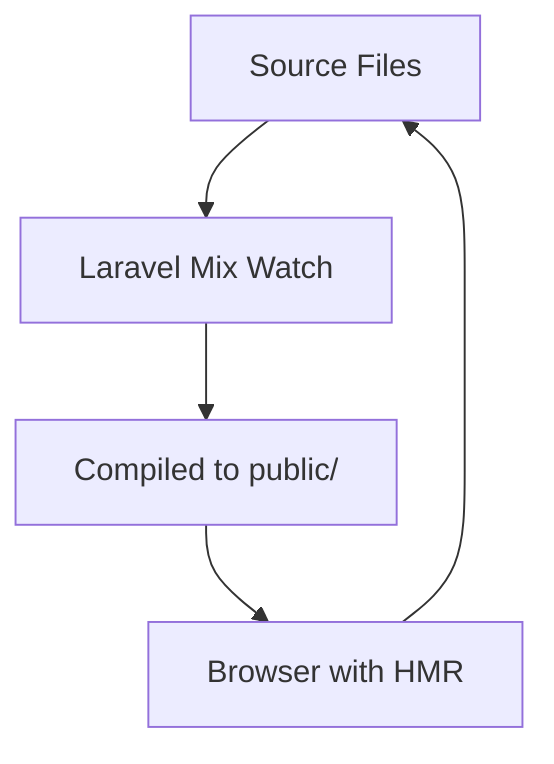
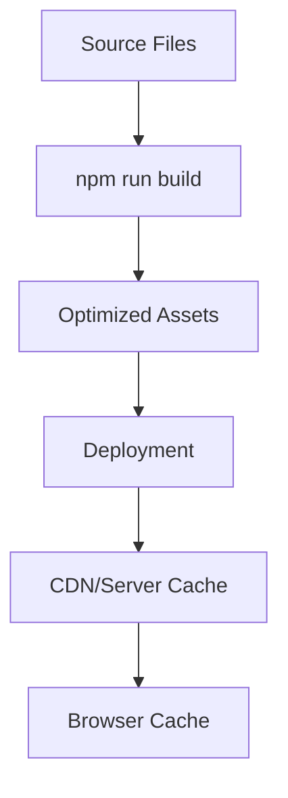

# HTML-JS-CSS Asset Flow in Laravel Application

## Overview

This document explains how frontend assets (HTML, JavaScript, CSS) flow through the SocietyPal Laravel application from development to production, including compilation, optimization, and deployment strategies.

## Asset Processing Pipeline

### 1. Development Environment

#### Source Files Location
```
├─ resources/
│  ├─ js/
│  │  ├─ app.js              # Main application JavaScript
│  │  └─ custom/             # Custom JavaScript files
│  ├─ css/                   # Raw CSS files
│  ├─ sass/
│  │  ├─ app.scss           # Main application styles
│  │  └─ custom/            # Custom SCSS files
│  └─ views/
│     ├─ layouts/           # Blade templates
│     ├─ components/        # Blade components
│     └─ custom/            # Custom view overrides
```

#### Development Processing
- **Laravel Mix**: Processes assets using Webpack
- **Live Compilation**: Assets compiled on-demand during development
- **Source Maps**: Generated for debugging
- **Hot Module Replacement**: Available for real-time updates

### 2. Build Process (Step 16)

#### Standard Laravel Mix Build
```bash
# Development build (with source maps)
npm run dev

# Production build (optimized)
npm run build
```

#### Build Output Structure
```
├─ public/
│  ├─ build/                # Laravel Mix output (production)
│  │  ├─ assets/
│  │  │  ├─ app-[hash].js   # Compiled & minified JavaScript
│  │  │  ├─ app-[hash].css  # Compiled & minified CSS
│  │  │  └─ manifest.json   # Asset versioning manifest
│  │  └─ mix-manifest.json  # Laravel Mix manifest
│  ├─ custom/               # Custom assets (protected)
│  │  ├─ css/
│  │  ├─ js/
│  │  └─ images/
│  ├─ css/                  # Legacy/direct CSS
│  ├─ js/                   # Legacy/direct JavaScript
│  └─ images/               # Static images
```

### 3. Custom Asset Strategy (Step 17)

#### Custom Asset Compilation (`webpack.custom.js`)
```javascript
const mix = require('laravel-mix');

// Custom assets that survive vendor updates
mix.js('resources/js/custom/app.js', 'public/custom/js')
   .sass('resources/sass/custom/app.scss', 'public/custom/css')
   .copy('resources/images/custom/', 'public/custom/images/')
   .version();
```

#### Custom Asset Benefits
- **Update-Safe**: Survive vendor application updates
- **Separate Compilation**: Independent of main application assets
- **Version Control**: Separate versioning from vendor assets
- **Override Capability**: Can override vendor styles/scripts

### 4. Asset Loading in Blade Templates

#### Standard Asset Loading
```php
{{-- Development: Load individual files --}}
@if (app()->environment('local'))
    <link href="{{ asset('css/app.css') }}" rel="stylesheet">
    <script src="{{ asset('js/app.js') }}"></script>
@else
    {{-- Production: Load compiled assets --}}
    <link href="{{ mix('css/app.css') }}" rel="stylesheet">
    <script src="{{ mix('js/app.js') }}"></script>
@endif
```

#### Custom Asset Loading
```php
{{-- Custom assets (always available) --}}
<link href="{{ asset('custom/css/app.css') }}" rel="stylesheet">
<script src="{{ asset('custom/js/app.js') }}"></script>

{{-- Conditional custom assets --}}
@if (config('custom.features.enable_custom_dashboard'))
    <link href="{{ asset('custom/css/dashboard.css') }}" rel="stylesheet">
    <script src="{{ asset('custom/js/dashboard.js') }}"></script>
@endif
```

### 5. Production Optimization

#### Laravel Artisan Caching (Step 16)
```bash
# Cache compiled views
php artisan view:cache

# Cache configuration (includes asset paths)
php artisan config:cache

# Cache routes (faster asset route resolution)
php artisan route:cache
```

#### Asset Optimization Features
- **Minification**: CSS/JS compressed for smaller file sizes
- **Versioning**: Cache-busting through filename hashes
- **Gzip Support**: Server-level compression
- **CDN Ready**: Assets can be served from CDN

### 6. Deployment Asset Flow (Step 18)

#### Shared vs Release Assets

```
/var/www/societypal.com/
├─ releases/
│  ├─ 20250815-143022/     # Release-specific assets
│  │  └─ public/
│  │     ├─ build/         # Compiled assets (release-specific)
│  │     ├─ css/           # Vendor CSS (release-specific)
│  │     └─ js/            # Vendor JS (release-specific)
│  └─ 20250815-150045/     # New release
├─ shared/                 # Persistent assets
│  └─ public/
│     ├─ uploads/          # User-uploaded files
│     ├─ invoices/         # Generated documents
│     ├─ custom/           # Custom assets (persistent)
│     └─ storage/          # Storage link target
└─ current -> releases/20250815-150045
```

#### Asset Persistence Strategy
- **Release Assets**: Compiled/vendor assets (disposable)
- **Shared Assets**: User uploads, custom files (persistent)
- **Symlink Strategy**: Shared assets linked into each release

### 7. Asset Loading Performance

#### Caching Strategy
```php
// Browser caching via mix() helper
mix('css/app.css') // Returns: /build/assets/app-a1b2c3.css

// Custom asset caching
asset('custom/css/app.css?v=' . config('app.version'))
```

#### Performance Optimizations
- **Asset Bundling**: Multiple files combined
- **Tree Shaking**: Unused code eliminated
- **Code Splitting**: Separate bundles for different sections
- **Lazy Loading**: Assets loaded on-demand

### 8. Development vs Production Flow

#### Development Flow


#### Production Flow


### 9. Asset Troubleshooting

#### Common Issues & Solutions

**Missing Assets (404)**
```bash
# Check if build completed
ls -la public/build/

# Rebuild assets
npm run build

# Clear Laravel caches
php artisan cache:clear
php artisan view:clear
```

**Stale Assets (Caching)**
```bash
# Force asset refresh
php artisan cache:clear

# Check mix-manifest.json
cat public/build/mix-manifest.json

# Verify asset versioning
grep -r "mix(" resources/views/
```

**Custom Assets Not Loading**
```bash
# Verify custom build process
npm run custom-build

# Check custom asset permissions
ls -la public/custom/

# Verify symlinks in deployment
ls -la shared/public/custom/
```

### 10. Security Considerations

#### Asset Security
- **Source Map Protection**: Not exposed in production
- **Directory Permissions**: Proper file permissions set
- **Upload Restrictions**: User uploads in shared/public only
- **Path Traversal Protection**: No direct file system access

#### Content Security Policy (CSP)
```php
// In middleware or layout
<meta http-equiv="Content-Security-Policy" content="
    script-src 'self' {{ asset('') }};
    style-src 'self' 'unsafe-inline' {{ asset('') }};
    img-src 'self' {{ asset('') }} data:;
">
```

## Best Practices Summary

### ✅ Do This
- Use Laravel Mix for asset compilation
- Implement proper asset versioning
- Separate custom assets from vendor assets
- Use appropriate caching strategies
- Test asset loading in production environment
- Monitor asset loading performance

### ❌ Never Do This
- Edit compiled assets directly
- Skip asset optimization for production
- Mix custom and vendor assets in same directory
- Ignore asset caching headers
- Deploy without testing asset compilation

## Integration Points

### With Customization Layer (Step 17)
- Custom assets stored in `public/custom/`
- Separate webpack configuration for custom assets
- Custom Service Provider manages asset loading
- Asset paths configurable via `config/custom.php`

### With Data Persistence (Step 18)
- User uploads preserved in shared storage
- Custom assets maintained across deployments
- Symlink strategy for asset availability
- Backup procedures include custom assets

### With Documentation (Step 19)
- Asset strategy documented in investment protection
- Build processes included in deployment procedures
- Team handoff includes asset management knowledge

## Summary

The HTML-JS-CSS asset flow in this Laravel application follows a strategic three-tier approach:

1. **Development Tier**: Live compilation with debugging capabilities
2. **Custom Tier**: Update-safe custom assets with separate compilation
3. **Production Tier**: Optimized, cached, and versioned assets with deployment persistence

This approach ensures optimal performance, maintainability, and protection of custom investments while supporting seamless vendor updates and zero-downtime deployments.