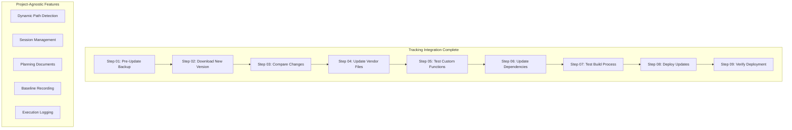

# 🔄 Vendor Update Deployment: Ultra-Powerful Pipeline Master Document

**Current Status**: ✅ **TRACKING INTEGRATED** | 🟢 **READY FOR EXECUTION**  
**Confidence Level**: 🟢 **100% READY FOR VENDOR UPDATE CYCLES**  
**Next Action**: Execute vendor updates using integrated tracking system

---

## 📊 **Current Reality Check**

### ✅ **COMPLETED: Vendor Update Flow with Tracking Integration**

-   **Step 01**: Pre-Update Backup with comprehensive tracking ✅
-   **Step 02**: Download New CodeCanyon Version with tracking ✅
-   **Step 03**: Compare Changes with detailed tracking logs ✅
-   **Step 04**: Update Vendor Files with tracking integration ✅
-   **Step 05**: Test Custom Functions with execution logging ✅
-   **Step 06**: Update Dependencies with tracking system ✅
-   **Step 07**: Test Build Process with comprehensive logging ✅
-   **Step 08**: Deploy Updates with method-specific tracking ✅
-   **Step 09**: Verify Deployment with complete verification framework ✅

### 🎯 **TRACKING SYSTEM INTEGRATION COMPLETE**

-   **Project-Agnostic Paths**: All steps use dynamic path detection
-   **Session Management**: Automatic session directory creation and management
-   **Planning Integration**: Each step generates detailed planning documents
-   **Baseline Recording**: Comprehensive before/after state capture
-   **Execution Logging**: Real-time progress tracking and results logging
-   **Linear ADHD-Friendly Structure**: Numbered, sequential tracking approach

---

## 🔄 **Vendor Update Pipeline Flow**

### **Phase VU-1: Pre-Update Preparation (Steps 01-03)**

```
Critical Foundation Steps
├── Step 01: Pre-Update Backup System
│   ├── Complete project backup
│   ├── Custom code preservation
│   └── Recovery point establishment
├── Step 02: CodeCanyon Version Download
│   ├── New version acquisition
│   ├── Version comparison setup
│   └── Update preparation
└── Step 03: Change Analysis
    ├── File difference analysis
    ├── Custom code impact assessment
    └── Update strategy planning
```

### **Phase VU-2: Update Execution (Steps 04-06)**

```
Core Update Implementation
├── Step 04: Vendor File Updates
│   ├── Safe vendor file replacement
│   ├── Custom code preservation
│   └── Conflict resolution
├── Step 05: Custom Function Testing
│   ├── Custom code compatibility verification
│   ├── Function integrity testing
│   └── Issue identification and resolution
└── Step 06: Dependency Management
    ├── Composer dependency updates
    ├── NPM package updates
    └── Version compatibility verification
```

### **Phase VU-3: Deployment & Verification (Steps 07-09)**

```
Build, Deploy, and Verify
├── Step 07: Build Process Testing
│   ├── Production build verification
│   ├── Asset optimization testing
│   └── Build process validation
├── Step 08: Update Deployment
│   ├── Method A: Manual SSH Deployment
│   ├── Method B: GitHub Actions Deployment
│   ├── Method C: DeployHQ Professional Deployment
│   └── Method D: GitHub + Manual Build Deployment
└── Step 09: Deployment Verification
    ├── Application functionality verification
    ├── Performance and security validation
    ├── Monitoring setup
    └── Final verification reporting
```

---

## 📋 **Step Execution Dependencies with Tracking**

### **🔗 Vendor Update Dependency Chain**



### **📝 Step-by-Step Tracking Integration Details**

#### **Step 01: Pre-Update Backup** ✅ **TRACKING INTEGRATED**

-   **Features**: Project-agnostic path detection, session initialization
-   **Tracking**: Backup planning, baseline recording, execution logging
-   **Deliverable**: Complete backup with tracking documentation
-   **Next Step**: Enables Step 02 execution with session continuity

#### **Step 02: Download New CodeCanyon Version** ✅ **TRACKING INTEGRATED**

-   **Features**: Download tracking, version comparison logging
-   **Tracking**: Download planning, source verification, execution results
-   **Deliverable**: New version acquired with tracking records
-   **Next Step**: Enables Step 03 with version data logged

#### **Step 03: Compare Changes** ✅ **TRACKING INTEGRATED**

-   **Features**: Change analysis tracking, impact assessment logging
-   **Tracking**: Comparison planning, diff analysis, strategy documentation
-   **Deliverable**: Change impact report with execution tracking
-   **Next Step**: Enables Step 04 with informed update strategy

#### **Step 04: Update Vendor Files** ✅ **TRACKING INTEGRATED**

-   **Features**: File update tracking, custom preservation logging
-   **Tracking**: Update planning, file replacement logs, conflict resolution
-   **Deliverable**: Updated vendor files with preservation tracking
-   **Next Step**: Enables Step 05 with update verification needed

#### **Step 05: Test Custom Functions** ✅ **TRACKING INTEGRATED**

-   **Features**: Custom function testing, compatibility verification tracking
-   **Tracking**: Testing planning, function validation, issue resolution logs
-   **Deliverable**: Custom function compatibility verified with tracking
-   **Next Step**: Enables Step 06 with custom code validated

#### **Step 06: Update Dependencies** ✅ **TRACKING INTEGRATED**

-   **Features**: Dependency update tracking, version management logging
-   **Tracking**: Dependency planning, update execution, compatibility verification
-   **Deliverable**: Dependencies updated with full tracking documentation
-   **Next Step**: Enables Step 07 with dependencies verified

#### **Step 07: Test Build Process** ✅ **TRACKING INTEGRATED**

-   **Features**: Build process tracking, optimization verification
-   **Tracking**: Build planning, process execution, optimization results
-   **Deliverable**: Build process verified with comprehensive tracking
-   **Next Step**: Enables Step 08 with deployment-ready build

#### **Step 08: Deploy Updates** ✅ **TRACKING INTEGRATED**

-   **Features**: Method-specific deployment tracking, execution monitoring
-   **Tracking**: Deployment planning, method selection, execution results
-   **Methods**: A (Manual SSH), B (GitHub Actions), C (DeployHQ), D (GitHub + Manual)
-   **Deliverable**: Updates deployed with method-specific tracking
-   **Next Step**: Enables Step 09 with deployment verification needed

#### **Step 09: Verify Deployment** ✅ **TRACKING INTEGRATED**

-   **Features**: Comprehensive verification framework, validation tracking
-   **Tracking**: Verification planning, testing execution, final reporting
-   **Deliverable**: Deployment verified with complete tracking documentation
-   **Next Step**: Vendor update cycle complete with full documentation

---

## 🎯 **Tracking System Features by Step**

### **Universal Tracking Capabilities**

-   **Project-Agnostic Path Detection**: Works from any directory level
-   **Session Management**: Automatic session creation and continuation
-   **Linear Structure**: ADHD-friendly numbered tracking approach
-   **Planning Integration**: Each step generates detailed planning documents
-   **Baseline Recording**: Comprehensive before/after state capture
-   **Execution Logging**: Real-time progress tracking and results

### **Step-Specific Tracking Enhancements**

#### **Steps 01-03: Preparation Phase Tracking**

-   **Backup Verification**: Complete backup integrity tracking
-   **Version Analysis**: Detailed comparison and impact assessment
-   **Change Documentation**: Comprehensive change analysis logs

#### **Steps 04-06: Implementation Phase Tracking**

-   **File Update Tracking**: Detailed file replacement and preservation logs
-   **Custom Code Verification**: Function-by-function compatibility tracking
-   **Dependency Management**: Version-by-version update tracking

#### **Steps 07-09: Deployment Phase Tracking**

-   **Build Process Monitoring**: Complete build pipeline tracking
-   **Deployment Method Tracking**: Method-specific execution monitoring
-   **Verification Framework**: Comprehensive validation and reporting

---

## ⚡ **Quick Commands for Vendor Update Execution**

```bash
# Vendor Update Flow Directory
cd Admin-Local/0-Admin/zaj-Guides/1-Guides-Flows/C-Deploy-Vendor-Updates/1-Steps/

# Step 01: Pre-Update Backup
cat Step_01_Pre_Update_Backup.md
# Execute backup with integrated tracking

# Step 02: Download New Version
cat Step_02_Download_New_CodeCanyon_Version.md
# Execute download with version tracking

# Step 03: Compare Changes
cat Step_03_Compare_Changes.md
# Execute comparison with change analysis tracking

# Step 04: Update Vendor Files
cat Step_04_Update_Vendor_Files.md
# Execute updates with preservation tracking

# Step 05: Test Custom Functions
cat Step_05_Test_Custom_Functions.md
# Execute testing with compatibility tracking

# Step 06: Update Dependencies
cat Step_06_Update_Dependencies.md
# Execute dependency updates with version tracking

# Step 07: Test Build Process
cat Step_07_Test_Build_Process.md
# Execute build testing with optimization tracking

# Step 08: Deploy Updates
cat Step_08_Deploy_Updates.md
# Execute deployment with method-specific tracking

# Step 09: Verify Deployment
cat Step_09_Verify_Deployment.md
# Execute verification with comprehensive validation tracking
```

---

## 🔧 **Deployment Methods Integration**

### **Method A: Manual SSH Deployment**

-   **Tracking Features**: SSH execution logging, file transfer monitoring
-   **Integration**: Step-by-step deployment tracking with server validation
-   **Verification**: Manual deployment verification with tracking reports

### **Method B: GitHub Actions Deployment**

-   **Tracking Features**: Workflow execution monitoring, automated build tracking
-   **Integration**: CI/CD pipeline tracking with GitHub integration
-   **Verification**: Automated deployment verification with workflow reporting

### **Method C: DeployHQ Professional Deployment**

-   **Tracking Features**: Professional deployment monitoring, advanced tracking
-   **Integration**: Enterprise-grade deployment tracking with DeployHQ integration
-   **Verification**: Professional deployment verification with comprehensive reporting

### **Method D: GitHub + Manual Build Deployment**

-   **Tracking Features**: Hybrid approach tracking, enhanced security monitoring
-   **Integration**: Combined automated and manual tracking with security focus
-   **Verification**: Enhanced security verification with artifact tracking

---

## 🎯 **Success Metrics for Vendor Update Pipeline**

### **Quality Gates**

1. **Backup Integrity**: 100% backup verification with recovery capability tested
2. **Version Analysis**: Complete change impact assessment with tracking
3. **Update Safety**: Custom code preservation verified through all steps
4. **Build Process**: Production build verification with optimization tracking
5. **Deployment Success**: Method-specific deployment verification completed
6. **Final Verification**: Comprehensive application validation with reporting

### **Business Value Delivered**

-   ✅ **Zero Data Loss**: Complete backup and recovery capability
-   ✅ **Custom Code Protection**: Investment preservation through vendor updates
-   ✅ **Professional Tracking**: Enterprise-grade execution monitoring
-   ✅ **Method Flexibility**: Support for all major deployment approaches
-   ✅ **Quality Assurance**: Comprehensive verification at every step

### **Technical Excellence Standards**

-   ✅ **Tracking Integration**: Project-agnostic tracking in all 9 steps
-   ✅ **Documentation Quality**: Real-time execution logging and reporting
-   ✅ **Security Compliance**: Safe vendor update procedures with audit trails
-   ✅ **Performance Optimization**: Build process optimization with tracking
-   ✅ **Maintainability**: Clear procedures with comprehensive documentation

---

## 🚀 **Vendor Update Execution Workflow**

### **1. Pre-Execution Checklist** ⚡

```bash
# Verify tracking system availability
ls -la Admin-Local/0-Admin/zaj-Guides/0-General/1-Templates/5-Tracking-System/

# Ensure customization system is available if needed
ls -la Admin-Local/0-Admin/zaj-Guides/0-General/1-Templates/6-Customization-System/

# Verify project tracking directory
ls -la Admin-Local/1-CurrentProject/Tracking/
```

### **2. Execute Vendor Update Cycle** 🔗

**SEQUENCE**: 01 → 02 → 03 → 04 → 05 → 06 → 07 → 08 → 09 (strict order required)
**TRACKING**: Each step automatically integrates with tracking system
**VALIDATION**: Verify tracking files generated at each step completion

### **3. Monitor Execution Quality** 🎯

**SESSION TRACKING**: Monitor `Admin-Local/1-CurrentProject/Tracking/1-First-Setup/5-Current-Session/`
**EXECUTION LOGS**: Review step-specific execution logs for issues
**BASELINE COMPARISON**: Compare before/after states using baseline records

---

## 📚 **Integration with Template System**

### **Tracking System Integration**

-   **Location**: `Admin-Local/0-Admin/zaj-Guides/0-General/1-Templates/5-Tracking-System/`
-   **Features**: Linear ADHD-friendly structure with project-agnostic paths
-   **Usage**: Automatic integration in all 9 vendor update steps

### **Customization System Integration**

-   **Location**: `Admin-Local/0-Admin/zaj-Guides/0-General/1-Templates/6-Customization-System/`
-   **Features**: Custom code preservation during vendor updates
-   **Usage**: Integrated protection for custom modifications

### **Project-Specific Tracking**

-   **Location**: `Admin-Local/1-CurrentProject/Tracking/`
-   **Structure**: Organized tracking with session management
-   **Persistence**: Maintains tracking data across update cycles

---

**🎉 Vendor Update Pipeline Status: FULLY INTEGRATED WITH COMPREHENSIVE TRACKING**

**Confidence Level**: 🟢 **MAXIMUM** - All 9 steps integrated with project-agnostic tracking system

**Next Action**: Execute vendor updates using the fully integrated tracking system with confidence! 🔄

---

## 📄 **Related Documentation**

-   **Template System**: `Admin-Local/0-Admin/zaj-Guides/0-General/1-Templates/5-Tracking-System/README.md`
-   **Customization System**: `Admin-Local/0-Admin/zaj-Guides/0-General/1-Templates/6-Customization-System/README.md`
-   **Original Project Setup**: `Admin-Local/0-Admin/zaj-Guides/1-Guides-Flows/B-Setup-New-Project/Phase-2-Pre-Deployment-Preparation/1-Steps/PHASE-2-PIPELINE-MASTER.md`

**Documentation Version**: V1.0 - Comprehensive vendor update pipeline with full tracking integration
**Created**: $(date)
**Integration Status**: ✅ Complete across all 9 steps
