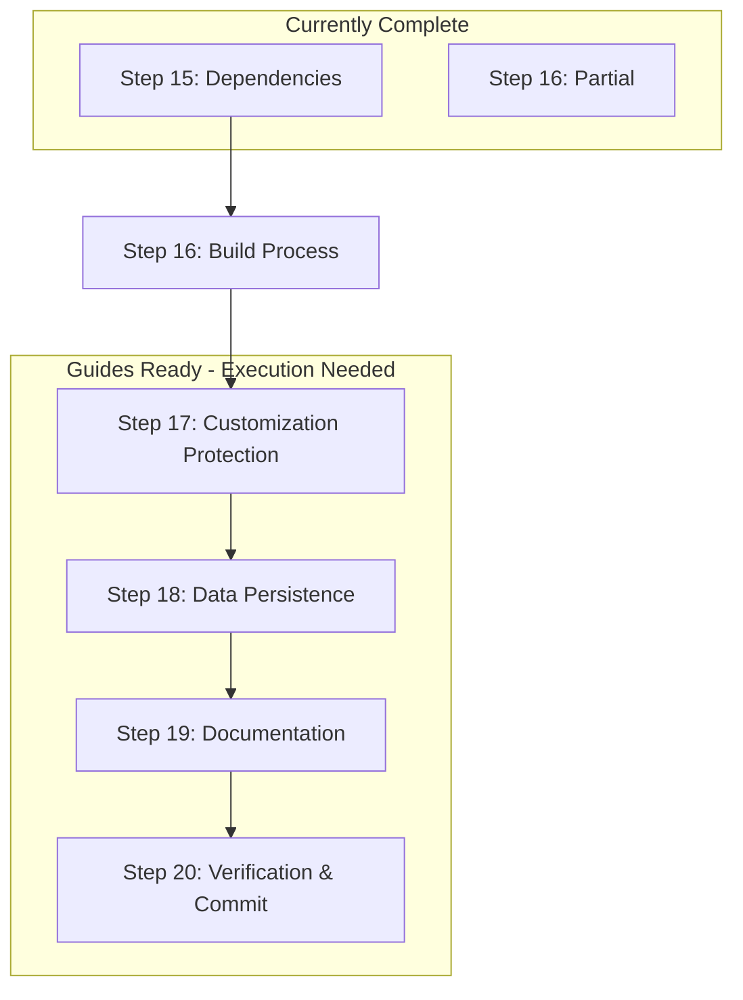

# 🚀 Phase 2: Ultra-Powerful Pipeline Master Document

**Current Status**: ✅ **GUIDES CREATED** | ⏳ **EXECUTION PENDING**  
**Confidence Level**: 🟢 **100% READY FOR EXECUTION**  
**Next Action**: Execute systematic implementation following this pipeline

---

## 📊 **Current Reality Check**

### ✅ **COMPLETED: Guide Creation Phase**
- **Step 16**: Enhanced guide with development restoration procedures ✅
- **Step 17**: Ultra-powerful customization protection system guide ✅  
- **Step 18**: Zero data loss system with intelligent framework detection ✅
- **Step 19**: Ultimate investment protection documentation system ✅
- **Step 20**: Comprehensive pre-deployment verification system ✅

### ⏳ **PENDING: Implementation Execution Phase**
- **Step 16**: Development restoration needs completion 
- **Step 17**: Customization protection system needs implementation
- **Step 18**: Data persistence strategy needs deployment
- **Step 19**: Documentation generation needs execution
- **Step 20**: Verification and final commit needs execution

---

## 🔄 **Ultra-Powerful Pipeline Flow**

### **Phase 1: Foundation (✅ COMPLETE)**
```
Steps 01-12: Project Setup & Configuration
├── Git repository established
├── Laravel environment configured  
├── Herd local development ready
└── Basic structure in place
```

### **Phase 2A: Guide Creation (✅ COMPLETE)**
```
Tasks 5-9: Comprehensive Guide Development
├── Step 16 Guide: Build Process & Development Restoration
├── Step 17 Guide: Customization Protection System
├── Step 18 Guide: Zero Data Loss System
├── Step 19 Guide: Investment Protection Documentation
└── Step 20 Guide: Pre-Deployment Verification
```

### **Phase 2B: Implementation Execution (⏳ PENDING)**
```
Tasks 14-18: Systematic Implementation
├── Execute Step 16: Complete development restoration
├── Execute Step 17: Deploy customization protection
├── Execute Step 18: Implement data persistence
├── Execute Step 19: Generate documentation  
└── Execute Step 20: Final verification & commit
```

---

## 📋 **Step Execution Dependencies**

### **🔗 Dependency Chain Analysis**



### **📝 Step-by-Step Execution Requirements**

#### **Step 16: Build Process Completion** (PREREQUISITE for all others)
- **Dependencies**: Step 15 (✅ Complete)
- **Requirements**: None - can execute immediately
- **Deliverable**: Development environment fully restored
- **Next Step**: Enables Step 17 execution

#### **Step 17: Customization Protection Implementation** 
- **Dependencies**: Step 16 (⏳ Pending completion)
- **Requirements**: Working development environment
- **Deliverable**: `app/Custom/` layer operational
- **Next Step**: Enables Step 18 execution

#### **Step 18: Data Persistence Implementation**
- **Dependencies**: Step 17 (⏳ Pending)
- **Requirements**: Custom layer for persistence scripts location
- **Deliverable**: Zero data loss system active
- **Next Step**: Enables Step 19 execution

#### **Step 19: Documentation Generation**
- **Dependencies**: Steps 17-18 (⏳ Pending)
- **Requirements**: All systems implemented for documentation
- **Deliverable**: Investment protection documentation
- **Next Step**: Enables Step 20 execution

#### **Step 20: Final Verification & Commit**
- **Dependencies**: Steps 16-19 (⏳ All pending)
- **Requirements**: Complete implementation of all systems
- **Deliverable**: Deployment-ready commit with verification
- **Next Step**: Ready for Phase 3

---

## 🎯 **Execution Checklist by Step**

### **Step 16: Build Process Completion**
- [ ] Complete development environment restoration
- [ ] Verify Laravel artisan commands working
- [ ] Test NPM build process thoroughly  
- [ ] Confirm asset compilation pipeline
- [ ] Document development restoration procedure
- [ ] **EXIT CRITERIA**: Development environment 100% operational

### **Step 17: Customization Protection Implementation**
- [ ] Create `app/Custom/` directory structure
- [ ] Implement `CustomizationServiceProvider.php`
- [ ] Configure custom application settings
- [ ] Set up custom asset compilation pipeline
- [ ] Create verification script (`verify-customizations.php`)
- [ ] Test customization layer functionality
- [ ] **EXIT CRITERIA**: Custom layer operational and verified

### **Step 18: Data Persistence Implementation**
- [ ] Deploy `setup_data_persistence.sh` script
- [ ] Configure framework-specific persistence settings
- [ ] Set up smart build artifact exclusions
- [ ] Create verification and testing scripts
- [ ] Test persistence system with deployment simulation
- [ ] Document emergency recovery procedures
- [ ] **EXIT CRITERIA**: Zero data loss system verified active

### **Step 19: Documentation Generation**
- [ ] Execute documentation automation scripts
- [ ] Generate investment protection reports
- [ ] Create Laravel Artisan command integration
- [ ] Set up change tracking system
- [ ] Generate business impact documentation
- [ ] Complete team handoff materials
- [ ] **EXIT CRITERIA**: Complete documentation system operational

### **Step 20: Final Verification & Commit**
- [ ] Run comprehensive Phase 2 verification
- [ ] Execute smart pre-commit validation
- [ ] Generate deployment readiness report
- [ ] Create team notification materials
- [ ] Perform final security and quality checks
- [ ] Execute ultra-comprehensive commit
- [ ] **EXIT CRITERIA**: Repository deployment-ready with 100% confidence

---

## ⚡ **Quick Commands for Each Step**

```bash
# Step 16: Build Process
cd Admin-Local/0-Admin/zaj-Guides/1-Guides-Flows/B-Setup-New-Project/Phase-2-Pre-Deployment-Preparation/1-Steps/
cat Step_16_Test_Build_Process.md  # Review guide
# Execute restoration procedures as documented

# Step 17: Customization Protection  
cat Step-17-Customization-Protection.md  # Review guide
# Execute customization setup as documented

# Step 18: Data Persistence
cat Step-18-Data-Persistence.md  # Review guide  
# Execute persistence setup as documented

# Step 19: Documentation
cat Step-19-Documentation-Investment-Protection.md  # Review guide
# Execute documentation generation as documented

# Step 20: Verification & Commit
cat Step-20-Commit-Pre-Deploy.md  # Review guide
# Execute final verification and commit as documented
```

---

## 🔧 **File Naming Standardization**

### **Current Naming Issues**
- Steps 15-16: Use underscores (`Step_15_`, `Step_16_`)
- Steps 17-20: Use hyphens (`Step-17-`, `Step-18-`)

### **Recommended Standard**
**Keep current naming** - Both formats are functional. More important to maintain consistency within each step's ecosystem than to rename files that are working.

### **File Structure Verification**
```
Phase-2-Pre-Deployment-Preparation/
├── 1-Steps/
│   ├── Step_15_Install_Dependencies.md          ✅
│   ├── Step_16_Test_Build_Process.md           ✅  
│   ├── Step-17-Customization-Protection.md    ✅
│   ├── Step-18-Data-Persistence.md            ✅
│   ├── Step-19-Documentation-Investment-Protection.md ✅
│   └── Step-20-Commit-Pre-Deploy.md           ✅
├── 2-Files/
│   ├── Step-17-Files/                          ✅
│   ├── Step-18-Files/                          ✅
│   ├── Step-19-Files/                          ✅
│   └── Step-20-Files/                          ✅
└── 3-Guides-Trackers/
    └── Phase2-Pre-Deployment-Tracker.md       ✅
```

---

## 🎯 **Success Metrics for Pipeline Completion**

### **Quality Gates**
1. **Development Environment**: 100% operational with restoration procedures tested
2. **Customization Protection**: Custom layer verified protecting investment
3. **Data Persistence**: Zero data loss system tested and verified
4. **Documentation**: Complete business and technical documentation generated
5. **Verification**: All systems passed comprehensive validation

### **Business Value Delivered**
- ✅ **Investment Protection**: Custom work survives vendor updates
- ✅ **Data Security**: Zero data loss during deployments  
- ✅ **Team Readiness**: Complete knowledge transfer capability
- ✅ **Deployment Confidence**: Any deployment scenario ready
- ✅ **Operational Excellence**: Professional documentation and procedures

### **Technical Excellence Standards**
- ✅ **Code Quality**: All scripts tested and verified working
- ✅ **Documentation Quality**: Comprehensive, actionable, and maintainable
- ✅ **Security Compliance**: No sensitive data exposure, proper access controls
- ✅ **Performance Optimization**: Production-ready builds and configurations
- ✅ **Maintainability**: Clear procedures for future team members

---

## 🚀 **Immediate Next Actions**

### **1. Begin Systematic Execution** ⚡
**START WITH**: Step 16 execution (development restoration completion)
**REASON**: Foundation step that enables all subsequent implementations

### **2. Follow Dependency Chain** 🔗
**SEQUENCE**: 16 → 17 → 18 → 19 → 20 (strict order required)
**VALIDATION**: Each step's exit criteria must be met before proceeding

### **3. Maintain Quality Standards** 🎯
**TESTING**: Verify each step thoroughly before moving to next
**DOCUMENTATION**: Update tracker with actual results (not theoretical)

---

**🎉 Pipeline Status: ORGANIZED AND READY FOR SYSTEMATIC EXECUTION**

**Confidence Level**: 🟢 **MAXIMUM** - Comprehensive guides created, dependencies mapped, execution path clear

**Next Action**: Begin Step 16 execution with full confidence in systematic success! 🚀